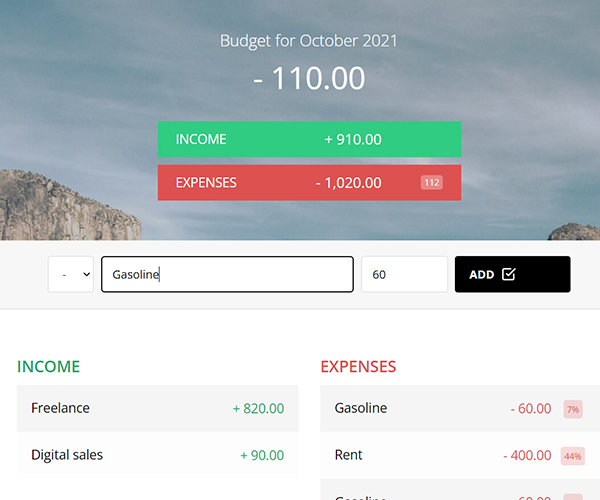

Users can add income or expense, and the program calculates overall budget for the month.

For every expense and for all added expenses, the app also calculates percentage from income. The percentage re-calculates every time new expense or income added.
